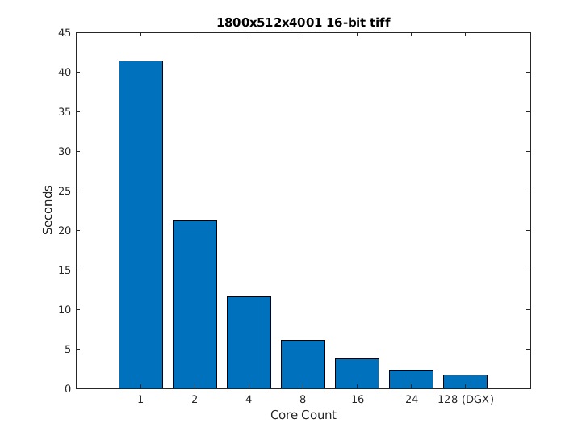

# Parallel_TIFF_Reader

An optimized and efficient parallel tiff reader that utilizes LibTIFF and OpenMP.

parallelReadTiff supports 8 bit, 16 bit, single-precision, and double-precision images.

# Read Time Comparison

NOTE: CPU used for the 1,2,4,8,16,24 core tests is a dual Intel(R) Xeon(R) Gold 6146 CPU @ 3.20GHz 

# MATLAB USAGE

The mex files can be called directly from MATLAB once added to the MATLAB path.

Windows mex extentsion - .mexw64

Linux mex extentsion - .mexa64

Mac mex extentsion - .mexmaci64

EXAMPLE USE (Returns a 3D array in y,x,z format):

myTiff = parallelReadTiff('C:\Users\Example\Desktop\test.tif');

USER DEFINED Z STACK RANGE EXAMPLE USE (Will give the first 1000 z stacks of an image):

myTiff = parallelReadTiff('C:\Users\Example\Desktop\test.tif',[1,1000]);

getImageSize_mex EXAMPLE USE (Returns the size in [y,x,z] format):

myTiffSize = getImageSize_mex('C:\Users\Example\Desktop\test.tif');
 

# MATLAB COMPILATION

NOTE: When compiling the mex file yourself. You will need to have libtiff compiled on your system.

(You may also need zlib compiled on your system as it is a dependency for some options in libtiff)

# Windows (Tested using MinGW64 Compiler (C))

mex -v COPTIMFLAGS="-O3 -fwrapv -DNDEBUG" CFLAGS='$CFLAGS -O3 -fopenmp' LDFLAGS='$LDFLAGS -O3 -fopenmp' '-IC:\path\to\libtiff\include' '-LC:\path\to\libtiff\lib\' -ltiff.lib parallelReadTiff.c

# Linux (Tested using GCC 8.3.0)

mex -v COPTIMFLAGS="-O3 -fwrapv -DNDEBUG" CFLAGS='$CFLAGS -O3 -fopenmp' LDFLAGS='$LDFLAGS -O3 -fopenmp' '-I/path/to/libtiff/include' '-L/path/to/libtiff/include/' -ltiff parallelReadTiff.c

# Mac (Tested compiling with GCC on Mac)

NOTE: Mac's default compilers in MATLAB do not support openmp so it is suggested to compile it using GCC or install the needed libraries for openmp to work with your compiler.

Step 1: /usr/local/Cellar/gcc/11.2.0_3/bin/gcc-11 -c -DMATLAB_DEFAULT_RELEASE=R2017b -DUSE_MEX_CMD  -DMATLAB_MEX_FILE -I"/usr/local/include" -I"/usr/local/opt/llvm/include" -I"/Applications/MATLAB_R2021a.app/extern/include" -I"/Applications/MATLAB_R2021a.app/simulink/include" -fno-common -arch x86_64 -mmacosx-version-min=10.14 -fexceptions -isysroot /Applications/Xcode.app/Contents/Developer/Platforms/MacOSX.platform/Developer/SDKs/MacOSX12.1.sdk -fopenmp -Wall -I/usr/local/opt/llvm/include -O3 -Xpreprocessor -fopenmp -lpthread -mmacosx-version-min=11.10 -O3 -fwrapv -DNDEBUG "main.c" -o main.o

Step 2: /usr/local/Cellar/gcc/11.2.0_3/bin/gcc-11 -c -DMATLAB_DEFAULT_RELEASE=R2017b -DUSE_MEX_CMD  -DMATLAB_MEX_FILE -I"/usr/local/include" -I"/usr/local/opt/llvm/include" -I"/Applications/MATLAB_R2021a.app/extern/include" -I"/Applications/MATLAB_R2021a.app/simulink/include" -fno-common -arch x86_64 -mmacosx-version-min=10.14 -fexceptions -isysroot /Applications/Xcode.app/Contents/Developer/Platforms/MacOSX.platform/Developer/SDKs/MacOSX12.1.sdk -fopenmp -Wall -I/usr/local/opt/llvm/include -O3 -Xpreprocessor -fopenmp -lpthread -mmacosx-version-min=11.10 -O3 -fwrapv -DNDEBUG "/Applications/MATLAB_R2021a.app/extern/version/c_mexapi_version.c" -o c_mexapi_version.o

Step 3: /usr/local/Cellar/gcc/11.2.0_3/bin/gcc-11 -Wl,-twolevel_namespace -static-libgcc -undefined error -arch x86_64 -mmacosx-version-min=10.12 -bundle -Wl,-exported_symbols_list,"/Applications/MATLAB_R2021a.app/extern/lib/maci64/mexFunction.map" -fopenmp main.o c_mexapi_version.o -O3 -Wl,-exported_symbols_list,"/Applications/MATLAB_R2021a.app/extern/lib/maci64/c_exportsmexfileversion.map"  -L"/Applications/MATLAB_R2021a.app/bin/maci64" -lmx -lmex -lmat -lc++ -I"/usr/local/include" -L"/usr/local/lib" -ltiff -o main.mexmaci64

Mac Compilation for getImageSize_mex:

mex -v COPTIMFLAGS="-O3 -fwrapv -DNDEBUG" CFLAGS='$CFLAGS -O3 -mmacosx-version-min=11.10' LDFLAGS='$LDFLAGS -O3 -mmacosx-version-min=11.10' '-L/usr/local/lib' -ltiff '-I/usr/local/include' getImageSize_mex.c